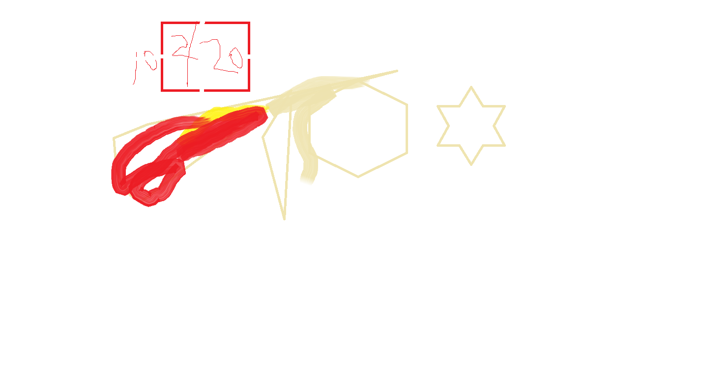

<!DOCTYPE html>
<html lang="tr">
<head>
    <meta charset="UTF-8">
    <meta name="viewport" content="width=device-width, initial-scale=1.0">
    <title>Benim Hakkımda</title>
    <link href="https://fonts.googleapis.com/css2?family=Roboto:wght@400;700&display=swap" rel="stylesheet">
    
    
</head>
<body>
    

        
        <h1>Murat Karaca</h1>
        

            Merhaba! Ben dijital dünyada kendini geliştirmeyi seven bir bireyim. 
            Çeşitli projelerde yer aldım ve her zaman yeni şeyler öğrenmeye açık biriyim. 
            Sade ve modern tasarım anlayışını benimsiyorum.
        

        

            <a href="https://facebook.com" target="_blank" class="facebook">
                <i class="fab fa-facebook-f"></i>Facebook
            </a>
            <a href="https://twitter.com" target="_blank" class="twitter">
                <i class="fab fa-twitter"></i>Twitter
            </a>
            <a href="https://instagram.com" target="_blank" class="instagram">
                <i class="fab fa-instagram"></i>Instagram
            </a>
            <a href="https://linkedin.com" target="_blank" class="linkedin">
                <i class="fab fa-linkedin-in"></i>LinkedIn
            </a>
        

    

</body>
</html>
